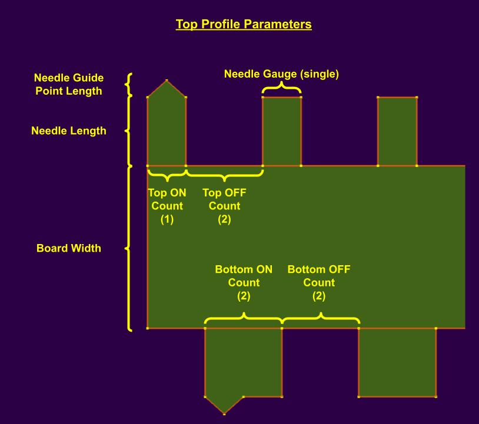
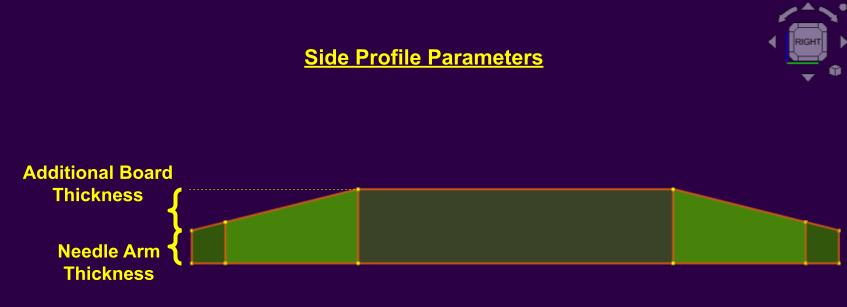

# parametric_needle_selector

A parametric CAD model for generating flatbed knitting machine needle selectors for 3D printing.

## Quick Start

- Download and install [FreeCAD](https://www.freecad.org/https://www.freecad.org/) for your operating system in order to open the `parametric_needle_selector.FCStd` file included in this repo.
- Open the "Parameters" spreadsheet and update the values to fit the specifications of your flatbed knitting machine and desired pattern.
- Click on the "Needle Selector Part" part in FreeCard then file > export into a `.stl` file.
- (Optional) Customize the 3D model in software such as [Blender](https://www.blender.org/) to add things like labelling, detailing, or texture.
- Use software such as [Orca Slicer](https://github.com/SoftFever/OrcaSlicer) to convert your model into G-code for 3D printing.

## Parameters

The following images show which dimensions are referenced by each parameter name. 

The only parameter not shown is "Enable Bottom Row" which simply flattens the bottom row of the selector when set to "0" or observes the desired pattern when set to "1".

### Top Profile Parameters

### Side Profile Parameters

